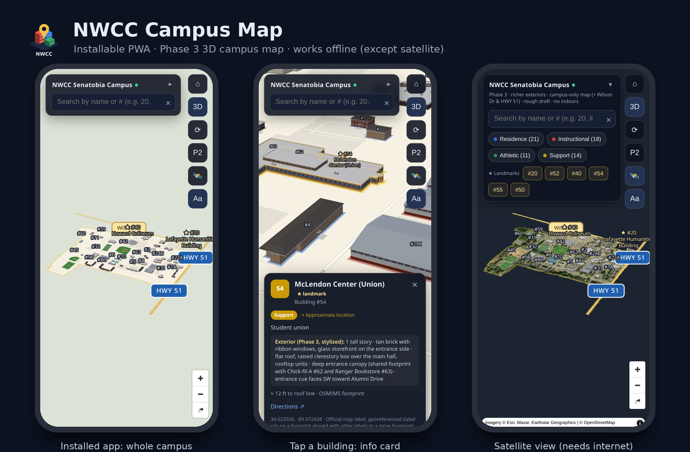

# NWCC Campus Map: installable PWA (Phase 3)

The **Phase 3** 3D campus map of Northwest Mississippi Community College (Senatobia campus only, plus the Wilson Dr and HWY 51 connectors) packaged as a **Progressive Web App**. You can install it on a phone's home screen. It opens full screen like a native app and works **offline**, except for satellite imagery.



- **Source:** `/workspace/nwcc-campus-map-phase3/`. That folder is unchanged. This folder is an adapted copy.
- **Map content:** same as Phase 3: procedural Three.js buildings in MapLibre GL, search, info cards, landmarks, category chips, 3D/2D, orbit, P2 compare, satellite, and labels. Phase 3's self-test passes here (`?selftest=1`: all search and 3D-pick checks).
- **Not included:** the `backup-pre-crop/` and `src/` build folders. They are still in the Phase 3 folder.

## 1. Serve it
A PWA needs **https://** or **http://localhost**. Without one of those, the service worker won't register and Android won't offer to install the app. `file://` does not work.

**On a computer (quick test):**
```bash
cd nwcc-campus-map-pwa
python3 -m http.server 8300
# open http://localhost:8300/ in Chrome/Edge → install icon in the address bar
```

**On a phone, pick one of these:**

| Option | How | Notes |
|---|---|---|
| **A. Static https host** (recommended) | Upload the folder contents (or the zip, unpacked) to GitHub Pages, Netlify Drop (drag the folder onto app.netlify.com/drop), Cloudflare Pages, or any web server with https. Then open the URL on the phone. | Works for iPhone and Android. A subfolder is fine (for example `https://you.github.io/nwcc-map/`), because all paths are relative. |
| **B. https tunnel to your computer** | Run `python3 -m http.server 8300`, then `cloudflared tunnel --url http://localhost:8300` (or `ngrok http 8300`). Open the https URL it prints on the phone. | Quick to set up. The URL changes each time the tunnel restarts. |
| **C. Android over USB** | Run `python3 -m http.server 8300`. Plug in the phone with USB debugging on. In desktop Chrome, open `chrome://inspect` → **Port forwarding**: `8300 → localhost:8300`. On the phone, open `http://localhost:8300/` in Chrome. | Counts as localhost, so the app can install. |
| **D. LAN https** | Use `mkcert` to make a cert for your computer's LAN IP and install the mkcert root CA on the phone. Then serve with any https static server. | More setup. A plain `http://192.168.x.x:8300` LAN address is **not** a secure context: the map runs, but the app won't install or work offline. |

## 2. Install on the phone
**Android (Chrome, Edge, Samsung Internet):** open the https URL. Then either tap the blue **"⬇ Install NWCC Map on this device"** button in the panel, or use the ⋮ menu → **Install app** / **Add to Home screen**. The app then shows up in the launcher as **NWCC Map**. Long-press the icon for the *Search* and *Satellite* shortcuts.

**iPhone / iPad (Safari, iOS 16.4+ also works from Chrome/Edge):** open the URL in Safari → tap **Share** (□↑) → **Add to Home Screen** → **Add**. The panel shows an **"⬇ Add NWCC Map to Home Screen"** button that repeats these steps. iOS has no automatic install prompt.

Open it from the home screen and it runs standalone (no browser bar). The first visit caches the whole app (about 3 MB). After that it opens offline.

## 3. Using it on a phone
- **One finger:** pan. **Pinch:** zoom. **Two-finger twist:** rotate. **Two-finger drag up/down:** tilt. **Tap a building:** info card (the map shifts the building above the card).
- The top panel starts collapsed on phones (search only). Tap **▸** to show the category chips and the ★ landmark buttons. Tapping a landmark collapses the panel again. `?hud=1` opens it expanded.
- The dot next to the title is green when online and amber when offline. Satellite (🛰️) needs internet. Everything else works offline.
- Tool buttons on the right: ⌂ fit campus · 3D/2D · ⟳ orbit · P2 compare · 🛰️ satellite · Aa labels. They are 44 px tap targets on touch screens.
- Phase 3 URL options still work: `#b=20`, `?q=library`, `?view=lng,lat,zoom,pitch,bearing`, `?sat=1`, `?cmp=1`, `?nolabels=1`, `?clean=1`, `?selftest=1`. They work offline too.

## What changed from Phase 3
| Area | Change |
|---|---|
| **Manifest** | `manifest.webmanifest`: name "NWCC Campus Map", short_name "NWCC Map", `display: standalone`, `start_url: ./`, `scope: ./`, theme/background `#0b1220`, icons 192/512 (any + maskable), phone/wide screenshots (richer Android install sheet), Search/Satellite shortcuts. |
| **Icons** | `icons/`: icon-192, icon-512, maskable 192/512, apple-touch-icon (180), favicon-32. Simple generated art (3D blocks in the category colors + gold pin + "NWCC"), from `tools/make_icons.py`. |
| **Service worker** | `sw.js` (version `da2f803bf5`). **Precache, cache-first:** index.html, app.js, pwa.js, exteriors.js, data.js, basemap.js, all .geojson/.json data, the manifest, icons, the vendored MapLibre + Three.js, and the label glyphs (24 URLs). Any page load in scope (including deep links) gets the cached shell. **Satellite tiles (Esri):** network only, never stored by the service worker. **CDN fallbacks** (jsDelivr/unpkg/protomaps, used only if a local file fails): network-first, with a cached copy for offline. Old caches are deleted when a new version activates. |
| **Offline dependencies** | MapLibre GL 4.7.1 (js + css) is now vendored in `vendor/`, where Phase 3 loaded it from unpkg. The label glyphs (Noto Sans Regular/Medium, ranges 0-255 + 9728-9983 for ★) are in `fonts/`, where Phase 3 loaded them from protomaps.github.io. The street basemap was already local, so **the whole campus map renders with no network**. |
| **Updates** | When you redeploy changed files, the app shows a toast, "A new version of the map is ready", with a **Reload** button. |
| **Phone UI** | `viewport-fit=cover` and `env(safe-area-inset-*)` padding on the panel, tools, card, and map controls (notch / home indicator), black-translucent iOS status bar. No pull-to-refresh or rubber-banding. 16 px search input, so iOS doesn't zoom on focus. Bigger touch targets. Card limited to 60% of screen height and scrolls on its own. Selected building is offset above the card. Phone-friendlier "fit campus" zoom. Keyboard closes after picking a result. Panel can collapse. Install button. Online/offline toasts. On desktop, the card no longer covers the tool buttons. |
| **app.js** | Three small edits, each marked `PWA`: local glyph URL, card-aware `flyTo` offset, phone fit zoom. Plus `closeCard`/`fitCampus` exposed on `window.NWCC_APP`. |

## Files
| File | What it is |
|---|---|
| `index.html` | Page shell + HUD + PWA meta tags and phone CSS |
| `app.js`, `exteriors.js` | Phase 3 map app and procedural exteriors |
| `pwa.js` | Service-worker registration, update toast, install button (Android prompt / iOS hint), online/offline status, collapsible panel |
| `sw.js` | Service worker (generated from `tools/sw.template.js`) |
| `manifest.webmanifest` | Web app manifest |
| `data.js`, `basemap.js`, `basemap.geojson`, `buildings_3d.geojson`, `boundary.json` | Phase 3 data (unchanged) |
| `vendor/` | `maplibre-gl.js/.css` 4.7.1 (BSD-3, license included), `three.module.js` r160 (MIT) |
| `fonts/` | MapLibre SDF glyph ranges for the labels |
| `icons/`, `screenshots/` | App icons and manifest screenshots |
| `tools/` | `make_icons.py`, `build_sw.py` (rewrites `sw.js` precache list + content-hash version), `sw.template.js`, `shots.js` / `pwa_test.js` (headless Chrome checks, need `puppeteer-core`), `make_preview.py` |

**After editing any app file**, run `python3 tools/build_sw.py`. It gives the service worker a new version, so installed copies pick up the change.

## Verified (headless Chrome, Pixel-size phone emulation, served from localhost)
- Service worker activates and controls the page. The shell cache holds all 24 URLs.
- `Page.getAppManifest`: no errors. `Page.getInstallabilityErrors`: **none** (installable). The `beforeinstallprompt` install button appears.
- **Offline:** a reload of `?q=library#b=40` with the network off rendered the full 3D map, labels, search results, and the Howard Coliseum card, with 0 failed requests.
- Phase 3 self-test passes (search + raycast picking for all landmarks, 59 building groups built).
- Not tested on a physical iPhone or Android device.

## Caveats
- Satellite imagery and the "Directions ↗" link (Google Maps) need internet.
- Building exteriors, heights, and entrances are the same stylized Phase 3 assumptions (see the Phase 3 README). This is a rough draft, not survey data. No indoor floors, no AR.
- Esri imagery is fetched live under Esri's terms. The app does not store tiles for offline use on purpose.

## Color + trees (2026-10-08)
- Ground colors follow the official 2D campus map (catalog.northwestms.edu "Senatobia Map.pdf"): lawn `#b7d99c`
  (campus polygon), athletic fields `#95b871` (OSM pitches), pavement/parking `#dcded2`, solid light walks.
- `trees.js` = 420 low-poly trees rendered as Three.js InstancedMeshes (not pickable). OSM has no tree/wood data on
  campus, so they are generated deterministically by `tools/build_trees.py` (seeded; needs shapely:
  `/workspace/venv-geo/bin/python tools/build_trees.py`, then `python3 tools/build_sw.py`).

## Marker fixes (2026-10-08, user-approved)
- #2 Bobo Hall, #7 Taylor Hall, #10 Calhoun Hall: moved from their printed-label spots (courtyard / parking lot) onto the
  blue halls the official map draws beside those labels, and given the real OSM footprints there (ways 1130670567,
  1130670566, 1472863871) instead of placeholder boxes / a small parking-lot structure. Calhoun (#10) is L-shaped, so its
  marker sits at the most interior point of the footprint (its centroid falls just outside the building).
- #3A DeSoto Hall A: marker centred on its footprint. All four now approx=false. #8D and #56 still awaiting confirmation.

## Building fixes (2026-10-09, user-approved; script: /workspace/building-check/fix/apply_bfix.py)
- #43 re-outlined on the real 49 × 19 m hip-roofed building (the OSM way under it was mis-tagged parking; that parking polygon is removed from the basemap).
- #44: placeholder "courts building" box removed; the north #44 is now 4 basketball courts + sand volleyball, and the tennis complex is drawn as two fenced blocks of 4 courts.
- #53 / #56 split (Tate Hall has its own dark pitched roof); the Union complex is split into #54 (big hip roof, 8.8 m), #62 (flat white) and #63 (pitched).
- Pitched roofs on the listed academic and residence halls (`perimeter_hip` with per-building `hip_inset` / simplified `roof_ring`); roof colours via `ext.roof_color` (#20 green metal, #32 red metal, #25A teal); heights #51/#52/#54/#55 raised; apartment halls 1/3/8/9 set to 2 stories.
- 13 unnumbered buildings (`properties.unnumbered`: drawn, not tappable, no label): stadium stands and field houses, Physical Plant north and west buildings, BSU, 3 cottages north of Thompson, softball building, tennis building, and the Marshall annex.
- Markers moved inside their footprints: 1A, 1B, 3B, 3C, 3D, 8D, 9B, 9C, 43, 44 (tennis).
